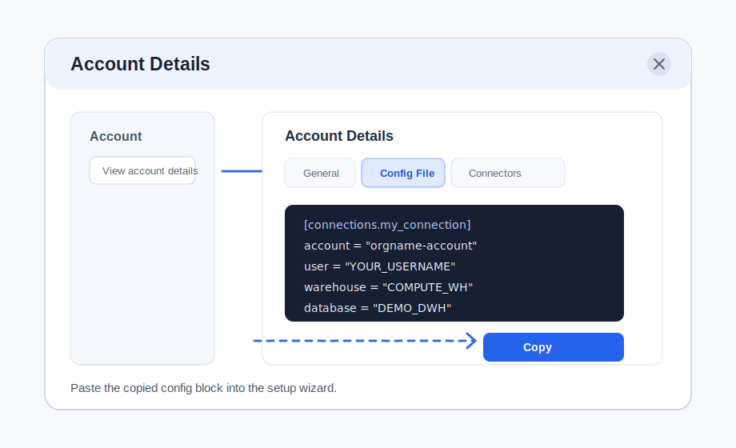

# Finding Snowflake Connection Settings

Use this when `scripts/setup.py` asks for account, user, warehouse, database, schema, role, and authenticator.

## Snowsight Path

1. Sign in to Snowsight.
2. Open the account selector for the account you are signed in to.
3. Select **View account details**.
4. Select the **Config File** tab.
5. Fill in warehouse, database, schema, and role if Snowflake shows editable fields.
6. Copy the generated `[connections.<name>]` block.
7. Paste the block into the setup wizard when it asks whether to paste a config block.

Official Snowflake docs: https://docs.snowflake.com/en/user-guide/admin-account-identifier#finding-the-organization-and-account-name-for-an-account

## Visual Guide



Example config block:

```toml
[connections.my_example_connection]
account = "orgname-accountname"
user = "YOUR_USERNAME"
authenticator = "externalbrowser"
role = "ACCOUNTADMIN"
warehouse = "COMPUTE_WH"
database = "DEMO_DWH"
schema = "RETAIL_MART"
```
